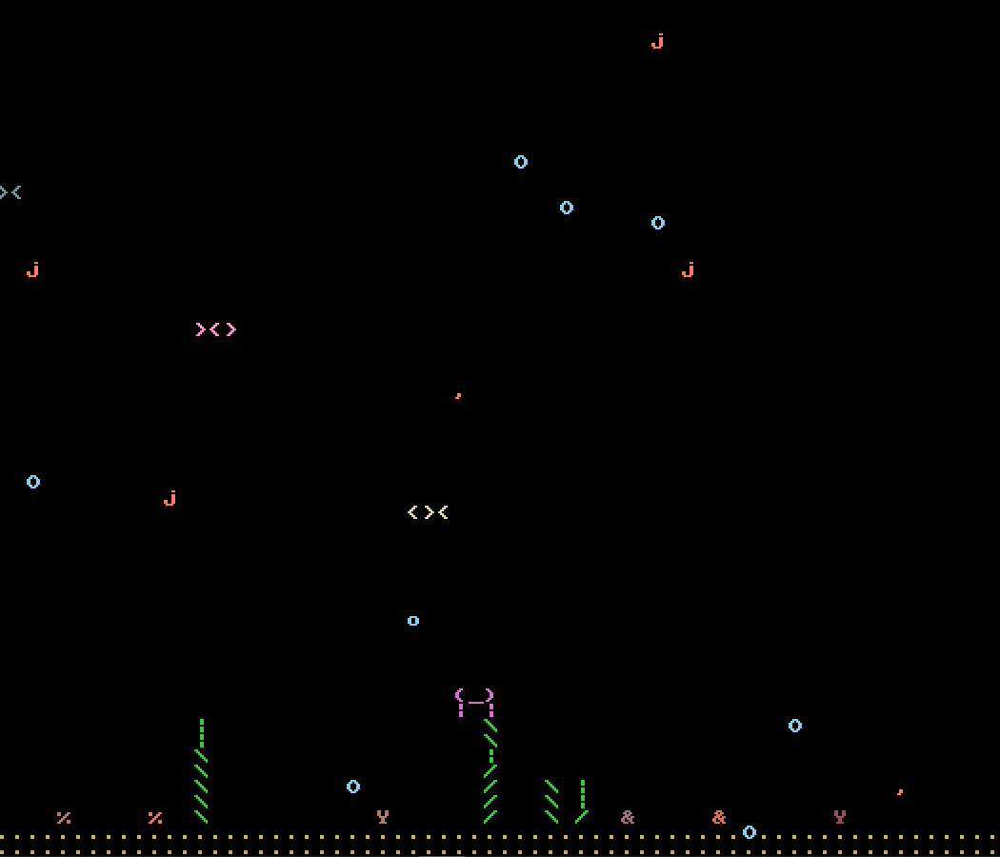
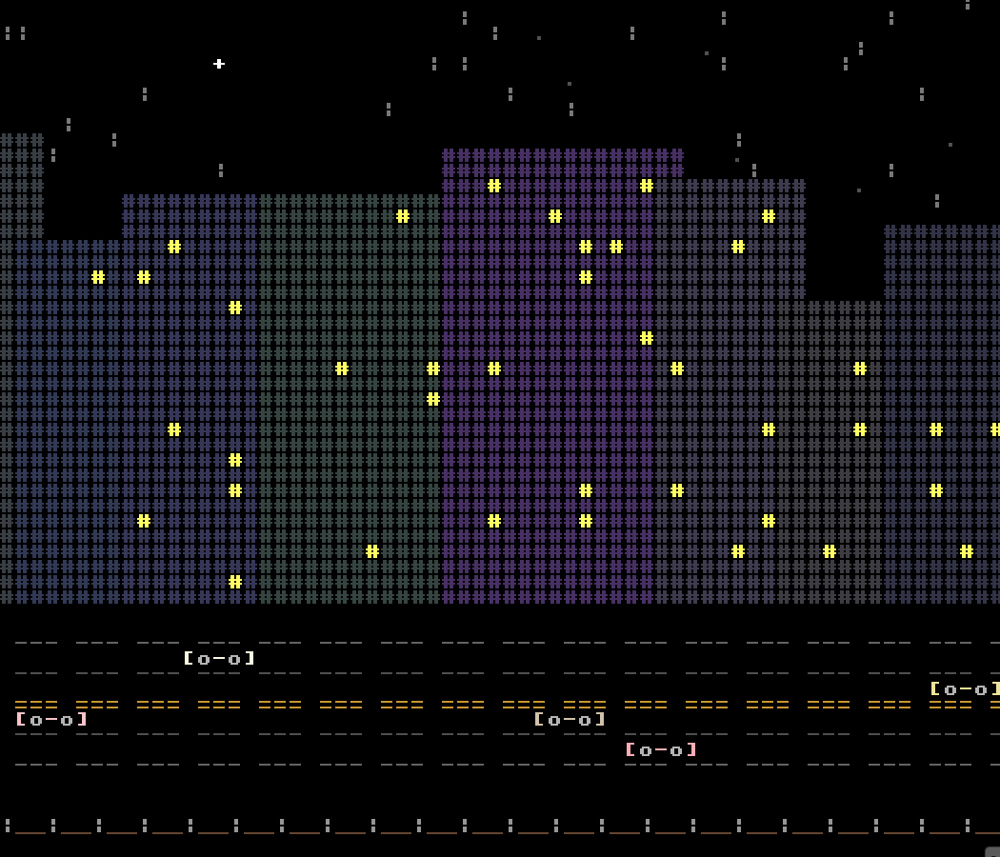

# ASCIIpaper

ASCIIpaper is a lightweight ASCII desktop wallpaper engine written in C++20. It runs efficiently in the background as a calm ambient simulation without draining your CPU.

Currently, ASCIIpaper is strictly a Windows application.

## Installation and Usage

### Using the Pre-compiled Binary (Windows)
1. Download and extract the latest release `.zip` file.
2. Run `ASCIIpaper.exe`. The application will silently attach to your desktop background and create a system tray icon.
3. Right-click the tray icon to switch scenes, toggle system sync, change weather (City only), or exit the application.
4. To toggle the application on startup, use the provided `toggle_startup.ps1` PowerShell script.

**Note on Windows Defender:** Because this is an unsigned open-source application, Windows Defender may flag the executable when you first launch it. This is expected without a commercial cryptographic certificate. To proceed, click **"More info"** and then **"Run anyway."**

### Building from Source
If you prefer to compile the engine yourself, you will need CMake and a C++20 compatible compiler.

**Windows:**
Clone the repository and run the following commands from the project root:

```bash
cmake -S . -B build -DCMAKE_BUILD_TYPE=Release -DASCII_DEBUG_MODE=OFF
cmake --build build --config Release
```

Once the build finishes, the compiled executable and the required `SDL3.dll` will be located in your `build/` or `build/Release/` directory.

**Aquarium Scene**


**City Scene with "storm" weather**


## Built-in Worlds

ASCIIpaper includes two primary ecosystems, each populated by unique ASCII entities. Note that only moving entities are listed below.

**Aquarium**
* **Fish:** `<><` and `><>`
* **Hermit Crab:** `@<` (moving right) and `>@` (moving left)
* **Jellyfish:** `( _ )` bell with flowing `~` and `:` tentacles
* **Shrimp:** `j` and `,`
* **Coral:** `&`, `%`, and `Y`
* **Bubbles:** `O` and `o`
* **Seaweed:** `|` stalk with `/` and `\` movement
* **Whale:**
```text
       .
      ":" 
    ___:____     |"\/"|
  ,'        `.    \  /
  |  O        \___/  |
   \________________/
```

**City**
* **Cars:** `[o-o]`
* **Train:** `[_]-` for cargo cars and `[_]>` for the engine car
* **Rain / Snow:** `|` for rain and lightning, `*` and `.` for snow

## Configuration

ASCIIpaper generates a default `config.ini` file in the same directory as the executable. The engine uses a built-in file watcher and CLI commands to hot reload these values instantly. Run `ASCIIpaper set [parameter] [value]` to apply updates.

| Parameter | Type | Description |
| --- | --- | --- |
| scene | string | The active environment (`aquarium`, `city`, `random`). |
| weather | string | Weather override (`none`, `rain`, `snow`, `storm`). |
| target_fps | int | The target rendering framerate. |
| system_sync | bool | Toggles CPU/RAM monitoring to dynamically affect simulation variables. |
| fish_count | int | Aquarium: Base number of fish. |
| bubble_count | int | Aquarium: Number of ambient bubbles. |
| jellyfish_count | int | Aquarium: Number of jellyfish. |
| shrimp_count | int | Aquarium: Number of shrimp. |
| car_count | int | City: Base traffic density. |
| star_count | int | City: Number of background stars. |

## Architecture & Future Goals

The codebase is partitioned to maintain strict abstractions for future cross-platform compatibility, using the Pimpl idiom for OS-specific implementations.

Development is currently focused on the 1.0 release for Windows, but the roadmap includes several major expansions:
* **Linux (X11) Support:** Native background attachment and daemon support for Linux environments.
* **Lua Scripting:** Embedding a Lua virtual machine to allow users to build and hot-load their own custom worlds and ASCII entities without modifying the C++ engine.
* **Packaged Releases:** Simple, one-click installation packages to make onboarding frictionless.

## License
[GPLv3 License](LICENSE)